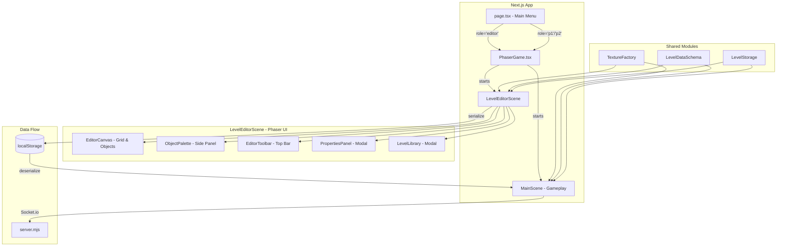
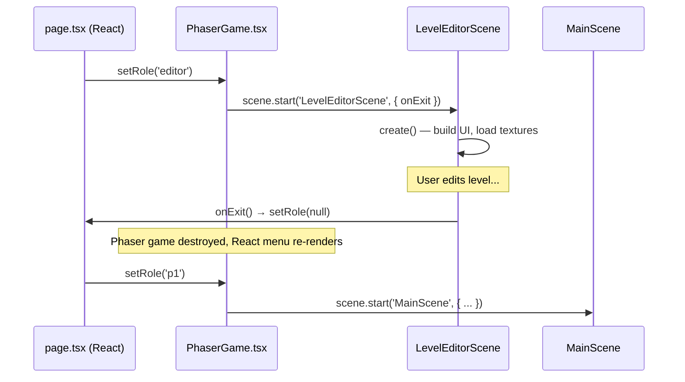

# Design Document: Level Editor

## Overview

The Level Editor is a full-screen visual tool that allows players to design custom Mario-style levels using point-and-click placement on a grid-based canvas. It operates as a **Phaser scene (`LevelEditorScene`)** within the same Phaser game instance used for gameplay, launched from the React main menu via a new `role = 'editor'` state. All editor UI — the object palette, toolbar, properties panel, and level library — is rendered using Phaser UI elements (text, graphics, containers) inside the single 800×480 canvas. Custom levels are serialized to a JSON `Level_Data` format stored in localStorage, and are playable in co-op mode using the existing `MainScene` game engine with a new `loadCustomLevel` method.

### Key Design Decisions

1. **Single Phaser instance, multiple scenes**: The editor is a `LevelEditorScene` class registered in the same Phaser game config as `MainScene`. The React main menu sets `role = 'editor'` which causes `PhaserGame.tsx` to start `LevelEditorScene` instead of `MainScene`. This avoids multiple canvas elements and leverages the existing Phaser lifecycle.

2. **All-Phaser UI**: The palette, toolbar, properties panel, and library modal are built with Phaser `Graphics`, `Text`, `Container`, and `Zone` objects. This keeps the entire editor self-contained within the Phaser canvas and avoids React/Phaser coordination complexity.

3. **Shared texture generation via `createTextures()`**: The existing `createTextures()` method in `MainScene` is extracted into a reusable `TextureFactory` module. `LevelEditorScene` calls the same factory so object thumbnails and canvas previews use identical procedural textures as gameplay.

4. **Level_Data as the single source of truth**: Custom levels are stored as a flat JSON structure describing object placements. The game engine parses this format at runtime, constructing the same Phaser game objects (blocks, enemies, pipes, etc.) that built-in levels use via hardcoded calls.

5. **No server changes for editing**: The editor is purely client-side. Only playback uses Socket.io (via the existing multiplayer sync). The server's `loadLevel` event is extended to accept a `"custom"` level indicator that tells clients to load from localStorage rather than a built-in level number.

6. **Exit returns to React menu**: Exiting the editor destroys the Phaser game instance (or stops the scene), returning control to React's main menu by resetting `role` to `null` via a callback prop.

## Architecture



### Scene Routing (replaces Page Routing)

- `role = null` — React main menu (existing)
- `role = 'editor'` — PhaserGame mounts with `LevelEditorScene` as the active scene
- `role = 'p1' | 'p2'` — PhaserGame mounts with `MainScene` as the active scene (existing)

The main menu gains a "Level Editor" button that sets `role = 'editor'`. The `PhaserGame` component reads this role and starts the appropriate scene. This ensures the editor shares the same Phaser canvas element and game lifecycle as gameplay.

### Integration with page.tsx

```typescript
// In page.tsx, the role state is extended:
const [role, setRole] = useState<'p1' | 'p2' | 'mini' | 'editor' | null>(null);

// Menu gets a new "Level Editor" button that calls:
setRole('editor');

// PhaserGame receives an onExit callback:
<PhaserGame role={role} onExit={() => setRole(null)} ... />
```

When `role = 'editor'`, `PhaserGame.tsx` configures the Phaser game to start `LevelEditorScene` and passes `onExit` into the scene's data so it can return to the menu.

### State Management

The editor uses a plain state object managed within `LevelEditorScene`:

- `objects: Map<string, PlacedObject>` — keyed by `"col,row"` grid position
- `undoStack: EditorAction[]` — last 50 actions
- `redoStack: EditorAction[]` — cleared on new action
- `selectedTool: PlaceableObjectType | null`
- `levelMetadata: { name: string, createdAt: string, slotNumber?: number }`
- `isDirty: boolean` — tracks unsaved changes

Phaser's `this.registry` or scene-level instance properties hold this state. No React state is needed inside the editor since all rendering is Phaser-based.

## Components and Interfaces

### Phaser Scene Components (all within LevelEditorScene)

| Component | Implementation | Responsibility |
|-----------|---------------|----------------|
| `EditorCanvas` | Phaser `Container` + `TileSprite` grid | Scrollable grid canvas, object placement/removal, grid overlay |
| `ObjectPalette` | Phaser `Container` + `Graphics` panels | Categorized object list with sprite thumbnails, click-to-select |
| `EditorToolbar` | Phaser `Container` + `Text` buttons | Save, Load, Undo, Redo, Exit, "Save as Game Level" |
| `PropertiesPanel` | Phaser `Container` (modal overlay) | Speed/range/piranha config for placed objects |
| `LevelLibrary` | Phaser `Container` (modal overlay) | List saved levels with Play, Edit, Delete |
| `ValidationErrors` | Phaser `Text` overlay | Inline error display when save validation fails |

### Canvas Layout (800×480 viewport)

```
┌────────────────────────────────────────────────────────┐
│  Toolbar (800×40)  [Save][Load][Undo][Redo][Exit]      │ y: 0-40
├──────────────────────────────────┬─────────────────────┤
│                                  │  Object Palette     │
│  Editor Canvas (640×440)         │  (160×440)          │
│  - Grid overlay                  │  - Categories       │
│  - Placed objects                │  - Thumbnails       │
│  - Scroll left/right             │  - Selection state  │
│                                  │                     │
│                                  │                     │
└──────────────────────────────────┴─────────────────────┘
  x: 0-640                          x: 640-800
  y: 40-480                         y: 40-480
```

### Shared Modules

| Module | Location | Purpose |
|--------|----------|---------|
| `TextureFactory` | `src/lib/textureFactory.ts` | Extracted texture generation (from `createTextures()`) |
| `LevelDataSchema` | `src/lib/levelData.ts` | TypeScript types + validation for Level_Data JSON |
| `LevelStorage` | `src/lib/levelStorage.ts` | localStorage CRUD for custom levels |
| `LevelValidator` | `src/lib/levelValidator.ts` | Pre-save validation (flag, ground, castle checks) |

### Key Interfaces

```typescript
// src/lib/levelData.ts

export type ObjectCategory = 'terrain' | 'pipes' | 'enemies' | 'items' | 'platforms' | 'decorations' | 'required';

export type PlaceableObjectType =
  | 'ground_block' | 'purple_block' | 'castle_wall' | 'stair_block'
  | 'green_pipe_2' | 'green_pipe_3' | 'green_pipe_4'
  | 'purple_pipe_2' | 'purple_pipe_3' | 'purple_pipe_4'
  | 'goomba' | 'koopa' | 'hammer_brother' | 'piranha_plant'
  | 'coin' | 'question_block' | 'mushroom_block'
  | 'moving_platform'
  | 'flag_pole' | 'castle'
  | 'bush' | 'cloud' | 'hill';

export interface PlacedObject {
  type: PlaceableObjectType;
  col: number;        // grid column (x / 32)
  row: number;        // grid row (y / 32)
  properties?: ObjectProperties;
}

export interface ObjectProperties {
  // Moving platform
  speed?: number;          // 1-10 grid cells/sec (default 2)
  movementRange?: number;  // 1-20 grid cells (default 4)
  direction?: 'horizontal' | 'vertical';

  // Pipe
  hasPiranha?: boolean;    // default false
  pipeHeight?: 2 | 3 | 4; // default 2

  // Multi-cell objects store their anchor at top-left
  width?: number;          // in grid cells
  height?: number;         // in grid cells
}

export interface LevelData {
  name: string;
  createdAt: string;       // ISO 8601 timestamp
  objects: PlacedObject[];
  slotNumber?: number;     // if assigned as a main game level (6+)
  version: 1;             // schema version for future migration
}

export interface SavedLevelEntry {
  id: string;              // unique identifier (crypto.randomUUID())
  name: string;
  createdAt: string;
  slotNumber?: number;
  data: LevelData;
}
```

### Editor Action (for undo/redo)

```typescript
export type EditorAction =
  | { type: 'place'; object: PlacedObject; replaced?: PlacedObject[] }
  | { type: 'delete'; object: PlacedObject }
  | { type: 'replace'; prev: PlacedObject; next: PlacedObject }
  | { type: 'propertyChange'; objectKey: string; prevProps: ObjectProperties; nextProps: ObjectProperties };
```

### LevelEditorScene Class Outline

```typescript
// src/scenes/LevelEditorScene.ts (or inline in PhaserGame.tsx)

class LevelEditorScene extends Phaser.Scene {
  // State
  private objects: Map<string, PlacedObject>;
  private undoStack: EditorAction[];
  private redoStack: EditorAction[];
  private selectedTool: PlaceableObjectType | null;
  private isDirty: boolean;
  private scrollX: number;

  // UI Containers
  private toolbar!: Phaser.GameObjects.Container;
  private palette!: Phaser.GameObjects.Container;
  private canvas!: Phaser.GameObjects.Container;
  private gridOverlay!: Phaser.GameObjects.Graphics;
  private propertiesPanel!: Phaser.GameObjects.Container;
  private libraryPanel!: Phaser.GameObjects.Container;

  // Callbacks
  private onExit!: () => void;

  constructor() {
    super({ key: 'LevelEditorScene' });
  }

  init(data: { onExit: () => void }) {
    this.onExit = data.onExit;
  }

  create() {
    TextureFactory.createTextures(this);  // reuse shared textures
    this.buildToolbar();
    this.buildPalette();
    this.buildCanvas();
    this.setupInputHandlers();
  }

  // ... methods for placement, deletion, undo/redo, saving, validation
}
```

## Data Models

### Level_Data JSON Schema

```json
{
  "name": "My Cool Level",
  "createdAt": "2024-01-15T10:30:00.000Z",
  "version": 1,
  "slotNumber": 6,
  "objects": [
    { "type": "ground_block", "col": 0, "row": 13 },
    { "type": "ground_block", "col": 1, "row": 13 },
    { "type": "green_pipe_3", "col": 10, "row": 10, "properties": { "hasPiranha": true, "pipeHeight": 3 } },
    { "type": "goomba", "col": 20, "row": 12 },
    { "type": "moving_platform", "col": 30, "row": 8, "properties": { "speed": 3, "movementRange": 6, "direction": "horizontal" } },
    { "type": "flag_pole", "col": 200, "row": 5 },
    { "type": "castle", "col": 215, "row": 9 }
  ]
}
```

### Grid Coordinate System

- Canvas is 266 columns × 15 rows (8512px × 480px at 32px grid)
- Row 0 = top of canvas (y=0), Row 14 = bottom (y=448)
- Ground level corresponds to row 13 (y=416, matching `GY=440` in game with sprite offset)
- Player spawn: P1 at col 4, row 11 (x=150 maps to ~col 4); P2 at col 2, row 11
- Editor viewport shows 20 columns × 13.75 rows (640×440 visible area, toolbar takes top 40px)

### localStorage Structure

```
mario_custom_levels: {
  "levels": [
    { "id": "uuid-1", "name": "My Level", "createdAt": "...", "slotNumber": null, "data": {...} },
    { "id": "uuid-2", "name": "Boss Rush", "createdAt": "...", "slotNumber": 6, "data": {...} }
  ]
}
```

### Server Protocol Extension

The existing `loadLevel` socket event is extended:

```javascript
// server.mjs - new event
socket.on('loadCustomLevel', (levelId) => {
  io.to('game').emit('loadCustomLevel', levelId);
});
```

Clients receiving `loadCustomLevel` read the level from their own localStorage and call a new `generateCustomLevel(levelData)` method on `MainScene`.

### Scene Lifecycle & Transitions



## Correctness Properties

*A property is a characteristic or behavior that should hold true across all valid executions of a system—essentially, a formal statement about what the system should do. Properties serve as the bridge between human-readable specifications and machine-verifiable correctness guarantees.*

### Property 1: Grid snapping produces valid grid coordinates

*For any* pixel coordinate (x, y) within the canvas bounds, snapping to the grid SHALL produce a coordinate that is an exact multiple of 32 and is the nearest grid-cell boundary to the original coordinate.

**Validates: Requirements 3.2**

### Property 2: Placement replaces all occupied cells

*For any* canvas state and any Placeable_Object (single-cell or multi-cell) dropped at a valid grid position, after placement all grid cells covered by the new object SHALL contain only that object, and any previously occupying objects in those cells SHALL be removed.

**Validates: Requirements 3.3, 3.4**

### Property 3: Deletion frees all occupied cells

*For any* canvas state containing at least one placed object, deleting that object SHALL result in all grid cells it previously occupied being empty (unoccupied).

**Validates: Requirements 3.5**

### Property 4: Level_Data serialization round-trip

*For any* valid canvas state (set of PlacedObjects with valid types, positions, and properties), serializing to Level_Data JSON and then deserializing back SHALL produce an equivalent set of objects with identical types, grid positions, and properties.

**Validates: Requirements 5.1, 5.8, 8.1**

### Property 5: Level name length validation

*For any* string of length between 1 and 50 (inclusive), the level name validator SHALL accept it; *for any* empty string or string longer than 50 characters, the validator SHALL reject it.

**Validates: Requirements 5.3**

### Property 6: Flag pole count validation

*For any* Level_Data object list, the validator SHALL pass if and only if the list contains exactly one object of type `flag_pole`.

**Validates: Requirements 6.1**

### Property 7: Contiguous ground blocks at spawn validation

*For any* Level_Data object list, the validator SHALL pass the spawn check if and only if there exist at least 3 contiguous `ground_block` objects at the spawn-height row within the first 5 columns (columns 0–4).

**Validates: Requirements 6.2**

### Property 8: Castle position validation

*For any* Level_Data containing both a `flag_pole` and a `castle`, the validator SHALL pass if and only if the castle's column is strictly greater than the flag pole's column.

**Validates: Requirements 6.3**

### Property 9: Validation never mutates canvas state

*For any* canvas state (valid or invalid), running validation SHALL leave the canvas state byte-for-byte identical to its state before validation was invoked.

**Validates: Requirements 6.5**

### Property 10: Level library sorted by creation date descending

*For any* set of saved levels with distinct creation timestamps, the Custom_Level_Library display order SHALL always be sorted by creation date descending (most recent first).

**Validates: Requirements 7.1**

### Property 11: Corrupted or invalid data rejection

*For any* data that fails to parse as valid Level_Data (malformed JSON, missing required fields, or unrecognized object types), the system SHALL identify it as invalid and exclude it from loading or playing.

**Validates: Requirements 7.5, 8.7**

### Property 12: Property value clamping

*For any* numeric input for moving platform speed, the clamped value SHALL be within [1, 10]; *for any* numeric input for movement range, the clamped value SHALL be within [1, 20]. The clamped value SHALL be the nearest valid boundary when the input is outside the range.

**Validates: Requirements 9.5**

### Property 13: Undo-redo round trip

*For any* editor action performed on a canvas state, executing the action followed by undo followed by redo SHALL produce a canvas state identical to the state immediately after the original action.

**Validates: Requirements 11.1, 11.2**

### Property 14: Undo stack bounded at 50

*For any* sequence of N editor actions (where N > 50), the undo stack SHALL contain exactly 50 entries, representing the 50 most recent actions.

**Validates: Requirements 11.3**

### Property 15: New action after undo clears redo history

*For any* editor state where the redo stack is non-empty (due to prior undos), performing a new action SHALL result in the redo stack being empty.

**Validates: Requirements 11.4**

## Error Handling

### Categories of Errors

| Error Category | Trigger | Response |
|---|---|---|
| **Storage quota exceeded** | localStorage write fails with QuotaExceededError | Display error text in Phaser overlay, offer JSON file download as fallback (via hidden DOM link) |
| **Storage unavailable** | localStorage is null (private browsing, disabled) | Display persistent warning text in toolbar area on editor load, all saves trigger file download |
| **Corrupted level data** | JSON.parse throws or schema validation fails on load | Mark level as corrupted in library UI, allow deletion but block loading/playing |
| **Invalid object type on playback** | Level_Data contains a `type` not in `PlaceableObjectType` | Skip the object, log `console.warn` with object details, continue loading remaining objects |
| **Validation failure on save** | Level missing flag pole, spawn ground, or castle position | Block save, display all errors simultaneously in a ValidationErrors overlay, preserve canvas state |
| **Properties panel invalid input** | User enters value outside allowed range | Clamp to nearest boundary, show inline text error, disable Apply until all fields valid |
| **Socket.io disconnect during custom level play** | Network interruption during co-op custom level | Use existing reconnection logic in server.mjs; players see "Reconnecting..." overlay |
| **Level_Data version mismatch** | Future schema version encountered | Display "Level created with newer version" message, block loading |
| **Phaser scene crash** | Unhandled exception in LevelEditorScene | Scene-level try-catch in critical paths; on fatal error, call `onExit()` to return to React menu, localStorage data preserved |

### Error Handling Strategy

1. **Fail gracefully, never lose data**: Any error during save or validation must preserve the current canvas state. The editor never discards user work due to an error.

2. **User-facing errors are actionable**: Every error message tells the user what went wrong and what they can do (e.g., "Storage full — download level as file instead").

3. **Silent recovery for non-critical issues**: Unknown object types during playback are skipped with a console warning. The level still loads and is playable with the remaining valid objects.

4. **Defensive parsing**: `LevelStorage.loadAll()` wraps each level's parse in a try-catch so one corrupted level doesn't prevent loading the entire library.

5. **Boundary enforcement at input**: Properties panels clamp values on blur/submit rather than rejecting the entire form, reducing user friction.

### Error Recovery & Scene Isolation

- The `LevelEditorScene` wraps critical methods (`create`, save operations, load operations) in try-catch blocks. If a fatal error occurs, the scene calls `onExit()` to return to the React menu without crashing the browser tab.
- Since the editor and game share the same Phaser instance but use different scenes, a crash in the editor scene does not affect the game scene's integrity. Scene data is isolated.
- localStorage data persists independently of scene lifecycle — even if the Phaser game is destroyed and recreated, all saved levels remain accessible.

## Testing Strategy

### Testing Approach

This feature uses a **dual testing strategy** combining example-based unit tests with property-based tests to achieve comprehensive coverage of both specific scenarios and universal invariants.

### Property-Based Testing

**Library**: [fast-check](https://github.com/dubzzz/fast-check) (TypeScript PBT library, integrates with Jest/Vitest)

**Configuration**:
- Minimum 100 iterations per property test
- Each test tagged with: `Feature: level-editor, Property {N}: {description}`
- Tests target pure logic modules: `LevelDataSchema`, `LevelValidator`, `LevelStorage`, and the editor state management functions

**Properties to implement** (see Correctness Properties section above):
1. Grid snapping — test `snapToGrid(x, y)` with random pixel coordinates
2. Placement replaces cells — test `placeObject` logic with random states
3. Deletion frees cells — test `deleteObject` logic with random states
4. Serialization round-trip — test `serialize` / `deserialize` on random `PlacedObject[]`
5. Level name validation — test `validateLevelName` with random strings
6. Flag pole count — test `validateFlagPole` with random object lists
7. Spawn ground validation — test `validateSpawnGround` with random block arrangements
8. Castle position — test `validateCastlePosition` with random flag/castle positions
9. Validation immutability — test that validator doesn't mutate input
10. Sort order — test library sort with random level sets
11. Data rejection — test schema validation with random invalid inputs
12. Property clamping — test `clampProperty` with random numbers
13. Undo-redo round trip — test state management with random action sequences
14. Undo stack cap — test state management with 50+ random actions
15. Redo clear on new action — test state management branch behavior

**Note on testability**: The editor state logic (placement, deletion, undo/redo, validation) is extracted into pure functions that operate on the `Map<string, PlacedObject>` and action stacks. These functions are testable independently of Phaser. The Phaser scene merely calls these functions and renders the result.

### Unit Tests (Example-Based)

**Framework**: Vitest (aligns with Next.js ecosystem, fast, TypeScript-native)

**Coverage areas**:
- Pure state functions (place, delete, undo, redo with specific scenarios)
- Specific interaction flows (properties panel input clamping, palette category filtering)
- LevelStorage CRUD operations (save, load, delete, list)
- Integration points (Socket.io custom level event, game engine `generateCustomLevel`)
- Edge cases (empty undo stack, localStorage quota, corrupted single level in library)
- Scene initialization (textures created, UI containers positioned correctly)

### Integration Tests

- Custom level playback end-to-end: save level → load in game → verify objects spawned at correct positions
- Co-op sync: two clients load same custom level via Socket.io event → verify both see identical level
- Game progression: complete level 5 → transition to custom level 6 → verify state carries over
- Scene transitions: editor exit → menu render → game start → verify clean lifecycle

### Test File Organization

```
src/
  lib/
    __tests__/
      levelData.test.ts          # Serialization round-trip (PBT)
      levelData.unit.test.ts     # Specific schema examples
      levelValidator.test.ts     # Validation properties (PBT)
      levelStorage.test.ts       # Storage CRUD + corruption handling (PBT + unit)
      editorState.test.ts        # Placement, deletion, undo/redo (PBT)
      editorState.unit.test.ts   # Specific action sequences
      gridUtils.test.ts          # Grid snapping, clamping (PBT)
  scenes/
    __tests__/
      LevelEditorScene.test.ts   # Scene lifecycle, texture creation, UI layout
  components/
    __tests__/
      PhaserGame.test.tsx        # Role-based scene selection, onExit callback
```
